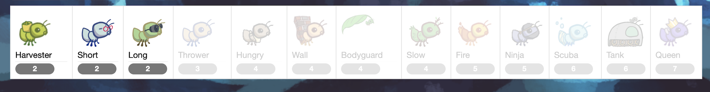

# Ant VS. Bees


## How to run

```
python3 gui.py [-h] [-d DIFFICULTY] [-w] [--food FOOD]
```
## Basic Rule
A game of Ants Vs. SomeBees consists of a series of turns. In each turn, new bees may enter the ant colony. Then, new ants are placed to defend their colony. Finally, all insects (ants, then bees) take individual actions. Bees either try to move toward the end of the tunnel or sting ants in their way. Ants perform a different action depending on their type, such as collecting more food, or throwing leaves at the bees. The game ends either when a bee reaches the end of a tunnel (you lose), or the entire bee fleet has been vanquished (you win).

## Core concept
**The Colony.** This is where the game takes place. The colony consists of several places that are chained together to form a tunnel where bees can travel through. The colony has some quantity of food that can be expended to deploy ant troops.

**Places.** A place links to another place to form a tunnel. The player can place a single ant into each place. However, there can be many bees in a single place.

**The Hive.** This is the place where bees originate. Bees exit the beehive to enter the ant colony.

**Ants.** Ants are the usable troops in the game that the player places into the colony. Each type of ant takes a different action and requires a different amount of food to place. The two most basic ant types are the HarvesterAnt, which adds one food to the colony during each turn, and the ThrowerAnt, which throws a leaf at a bee each turn. 


**Bees.** Bees are the antagonistic troops in the game that the player must defend the colony from. Each turn, a bee either advances to the next place in the tunnel if no ant is in its way, or it stings the ant in its way. Bees win when at least one bee reaches the end of a tunnel.
